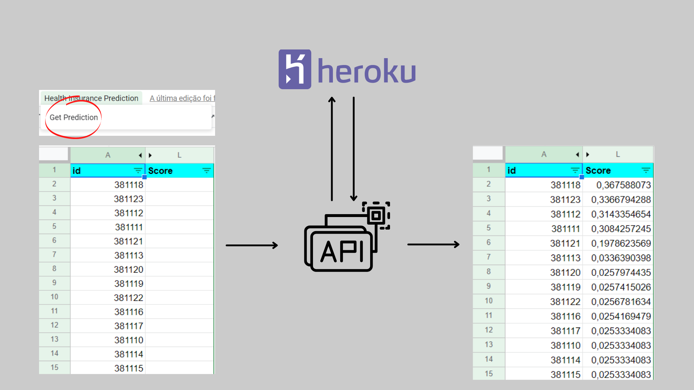

# Health Insurance Cross-Sell.

## 1.0. Description: 

This project aims to order a potential client list by propensity score.

## 2.0. Business Problem:

Our client is an insurance company that wants to sell a second insurance to an already consolidated customer base. For this, it carried out a survey with this entire base, verifying the interest of each of its customers in purchasing vehicle insurance. Our challenge is to sort this base according to the highest propensity to buy in order to minimize sales team cost.

## 3.0. Solution Strategy:

### 3.1. Data Collection:

At this point, I acessed data from a PostgreSQL Data Warehouse hosted in AWS and merged all tables to extract as a csv using python.

### 3.2. Data Description:

Here I focused on seeing the quantitity and quality of the data. Aimed to answer questions like how much data is available and the conditition of them. Checked the columns name, data dimensions, data types, NA's and done a descriptive statistics with all features.

### 3.3. Feature Engineering: 

Tried to derivate new features that make business sense from the existing ones.

### 3.4. Data Filtering: Filtragem dos dados visando algumas métricas do negócio.

Consists in filtering data considering business. That step was not needed for this project. 

### 3.5. Exploratory Data Analysis: 

Sought to understand a litte bit more of the data with tables, charts, and other visualization tools. Worked on three different fronts: univarieted, bivarieted and multivarieted analysis. Each one of them searching for different types of feelings and understanding about the data.

### 3.6. Data Preparation: 

Also called pre processing, consists in "translate" raw data into a language that the model understands. Data preparation involves tasks like: normalization, rescalling and encoding. This is a very important step and directly affects the model.

### 3.7. Feature Selection: 

Used an algorithm to decide wich features have more impact on the model. Allied with the business knowledge builted from the EDA, I chose the best features.

### 3.8. Machine Learning Modelling:

This is the point at which our hard work begins to pay off. The data we spent time preparing are brought into the machine learning models and the results begin to shed some light on the business problem posed during Business Understanding. Here I tested several models using chosen metrics for the problem and cross validation to see if the results were good or not.

### 3.9. Hyperparameter Fine Tunning: 

Used the random search method of Hyperparameter Fine Tuning in order to choose a set of optimal parameters for the model I chose. ( XGBoost )

### 3.10. Business Results:

Translated the metrics from the final model to the results the business will have if implement it.

### 3.11. Deploy:

Deployed the model to a production environment for that other people can use and get benefits of it. Also built a Google Sheets button using App Scripts that gives people prediction getting just a dataset as entry.

## 4.0. Top 3 Data Insights:

- **H1**: Customers with cars below 1 year have more interest in buying vehicle insurance.

**FALSE**. Of the total number of customers interested, the ones with a car younger than 1 year represent only 15.41%.

- **H2**: Customers that had their cars damaged have more interest in buying vehicle insurance.

**TRUE**. Almost all customers who are interested in buying vehicle insurance have already had their car damaged.

- **H3**: Customers with health insurance for more than 100 days have more interest in buying vehicle insurance.

**TRUE**. Of the total number of customers interested, 68,57% have health insurance for more than 100 days.

## 5.0. Machine Learning Models Applied:

- KNN
- Logistic Regression
- Extra Trees
- XGBoost
- LightGBM

## 6.0. Machine Learning Model Performance:

The model chosen for production was XGBoost, given its success in terms of metrics and memory.

### 6.1. Cumulative Gains Curve:

The cumulative gains curve is an evaluation curve that assesses the performance of the model and compares the results with the random pick. It shows the percentage of targets reached when considering a certain percentage of the population with the highest probability to be target according to the model.

## 7.0. Business Results:

### 7.1. At K metrics:

**Precision at K Meaning**: Within the first 20.000 customers sorted according to highest propensity to purchase, 31% of them (6,000) are really interested.

**Recall at K Meaning**: Within the first 20.000 customers sorted by highest propensity to purchase, are 83% of the total interested.

### 7.2. Lift Curve:

**Lift Curve Meaning**: The Lift Curve says how many times our model it's better than the baseline.

Considering the costs with sales team using the baseline model ( randomly ordered ) as **X**, we have that using the XGBoost our cost declines to X/Y.

**Example**: To reach 40% of our customers base using the baseline model we spend X dollars, let's say $1000. If using the XGBoost one we would spend $1000/2 = $500 ( because the graph shows that in this point the XGBoost model it's 2 times better than the baseline. In conclusion, our cost would decline 50%.

## 8.0. Conclusion:

Given the result of the project, it can be said that for a first cycle of the CRISP-DM methodology we were successful, delivering fast and effective results through a model capable of sorting a customer base by purchase propensity and returning this prediction in a table from Google Sheets.

## 9.0. Next Steps to improve:

- Discover more relevant features.
- Survival Analysis to estimate how many emails or calls until a customer purchase the vehicle insurance.

## 10.0. References:

- [Kaggle](https://www.kaggle.com/anmolkumar/health-insurance-cross-sell-prediction)
